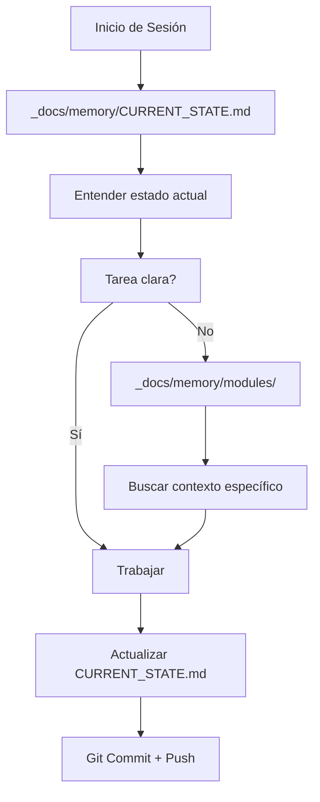

# 🤖 AGENTS.md - REGLAS UNIVERSALES PARA AGENTES

> **⚠️ MANDAMIENTO SUPREMO:**
> Este archivo es LEY. Todo agente (local, online, o futuro) DEBE seguir estas reglas.
> Desviarse de estas reglas = Caos en el proyecto.

---

## 📖 ÍNDICE RÁPIDO (TL;DR)

1. **Primero:** Leer `_docs/memory/CURRENT_STATE.md`
2. **Segundo:** Leer `_docs/README.md` (este archivo)
3. **Nunca:** Crear archivos `.md` en la raíz
4. **Siempre:** Actualizar `CURRENT_STATE.md` después de cambios
5. **Git:** Pull al inicio, Commit+Push al final

---

## 🏛️ JERARQUÍA DE DOCUMENTACIÓN

```
📁 _docs/
├── 📄 README.md              ← Leer para entender estructura
├── 📄 AGENTS.md              ← ESTE ARCHIVO (reglas)
├── 📁 memory/
│   ├── 📄 CURRENT_STATE.md   ← Leer PRIMERO siempre
│   ├── 📁 history/           ← Contexto histórico
│   └── 📁 modules/           ← Detalles por módulo
├── 📁 architecture/          ← Diseño técnico
└── 📁 protocols/             ← Protocolos de trabajo
```

### Orden de Lectura Obligatorio



---

## 🚫 PROHIBICIONES ABSOLUTAS

### ❌ NUNCA hagas esto:

| Prohibición | Consecuencia | Solución |
|-------------|--------------|----------|
| Crear archivos `.md` en la raíz | Desorden, duplicación | Usar `_docs/` siempre |
| Borrar `history/*.md` | Pérdida de contexto histórico | Mantener todo el historial |
| Ignorar `CURRENT_STATE.md` | Trabajar con info desactualizada | Leer PRIMERO |
| Modificar sin documentar | Siguiente agente confundido | Actualizar docs inmediatamente |
| Commit sin mensaje claro | Historial de git inútil | Mensajes descriptivos |

### ⚠️ ADVERTENCIAS:

1. **MEMORIA_PROYECTO.md y CLAW_PROJECT_MANIFEST.md** son sagrados
   - NO los borres
   - NO los muevas de `_docs/memory/history/`
   - Son la memoria histórica del sistema

2. **La raíz del proyecto** debe mantenerse LIMPIA
   - Solo: `README.md` (para humanos)
   - Solo: `AGENTS.md` (apuntador a este archivo)
   - Todo lo demás va en carpetas organizadas

---

## ✅ PROTOCOLO DE TRABAJO

### Al INICIAR (Checklist)

```markdown
- [ ] git pull (obtener últimos cambios)
- [ ] Leer _docs/memory/CURRENT_STATE.md
- [ ] Verificar estado general del sistema
- [ ] Identificar tarea a realizar
- [ ] Buscar contexto en modules/ si es necesario
```

### Durante el Trabajo

```markdown
- [ ] Hacer cambios incrementales
- [ ] Probar localmente (npm run dev)
- [ ] Verificar que no hay errores en consola
- [ ] Documentar decisiones en código (comentarios)
```

### Al FINALIZAR (Checklist)

```markdown
- [ ] Actualizar _docs/memory/CURRENT_STATE.md
- [ ] Si es cambio histórico, actualizar history/YYYY-MM.md
- [ ] Si es cambio de módulo, actualizar modules/NOMBRE.md
- [ ] git add .
- [ ] git commit -m "Tipo: Descripción clara del cambio"
- [ ] git push
- [ ] Notificar al usuario (si aplica)
```

---

## 🔄 COLABORACIÓN MULTI-AGENTE

### Agente Local (Tú)

**Ventajas:**
- Acceso directo al sistema de archivos
- Puede ejecutar código inmediatamente
- Puede reiniciar servidores

**Responsabilidades:**
- Mantener la estructura de carpetas
- Documentar TODO inmediatamente
- Sincronizar con Git regularmente
- Dejar el proyecto mejor de lo que lo encontró

### Agente Online (Versión Web)

**Limitaciones:**
- No puede ejecutar código directamente
- No puede reiniciar servidores
- Propone cambios vía Issues/PRs

**Responsabilidades:**
- Leer toda la documentación antes de proponer cambios
- Seguir las mismas convenciones de código
- Crear Issues descriptivos con contexto completo
- No romper la estructura establecida

### Flujo de Colaboración

```
Agente Online (Kimi Web)
         │
         ├── Lee _docs/ completo
         ├── Propone cambios vía GitHub Issue
         │
         ▼
Agente Local (Tú/Kimi CLI)
         │
         ├── Revisa el Issue
         ├── Implementa cambios si son válidos
         ├── Actualiza documentación
         ├── Hace commit y push
         │
         ▼
Agente Online (actualizado)
         │
         └── Ve los cambios reflejados
```

---

## 📝 CONVENCIONES DE CÓDIGO

### Commits de Git

```
Tipo: Descripción breve (máx 50 chars)

Descripción detallada si es necesario:
- Cambio 1
- Cambio 2
- Cambio 3

Refs: #issue-number (si aplica)
```

**Tipos de commit:**
- `Feat:` Nueva funcionalidad
- `Fix:` Corrección de bug
- `Docs:` Cambios en documentación
- `Refactor:` Refactorización de código
- `Test:` Adición de tests
- `Chore:` Tareas de mantenimiento

### Mensajes de Commit Buenos vs Malos

| ❌ Malo | ✅ Bueno |
|---------|----------|
| "cambios" | "Fix: Corrección de cálculo de salario en POS" |
| "update" | "Feat: Implementado sistema de notificaciones" |
| "arreglo" | "Refactor: Separación de backend y frontend en dev" |
| "todo" | "Docs: Actualizado CURRENT_STATE.md con nuevos módulos" |

---

## 🏗️ ARQUITECTURA DEL PROYECTO

### Estructura de Carpetas (Sagrada)

```
business_control_system/
├── 📁 client/              ← Frontend React + Vite
│   ├── src/
│   ├── public/
│   └── dist/               ← Build de producción (no tocar)
│
├── 📁 server/              ← Backend Node.js + Express
│   ├── index.js            ← Entry point principal
│   ├── inventory.db        ← Base de datos SQLite
│   └── uploads/            ← Imágenes subidas
│
├── 📁 _docs/               ← DOCUMENTACIÓN (aquí estás)
│   ├── memory/
│   ├── architecture/
│   └── protocols/
│
├── 📁 backups/             ← Respaldos automáticos de DB
├── 📁 registro-screenshots/ ← Capturas de pantalla
│
├── 📄 README.md            ← Para humanos (resumen)
├── 📄 AGENTS.md            ← Apuntador a _docs/AGENTS.md
└── 📄 package.json         ← Scripts del proyecto
```

### Separación Backend/Frontend

**En Desarrollo Local:**
```
Backend:  http://localhost:3001  (API-only)
Frontend: http://localhost:5173  (Vite dev server)
```

**Regla:** Nunca sirvas el frontend desde el backend en desarrollo.

**En Producción (Railway):**
```
Backend sirve frontend estático desde client/dist/
Todo en un solo puerto (process.env.PORT)
```

---

## 🧠 LÓGICA DE NEGOCIO (Leyes de Piedra)

### Ley 1: Jerarquía de Cierre de Ventas
> "El Vendedor NUNCA cierra la venta; solo solicita el cierre."

### Ley 2: Aislamiento de Sesiones
> "Cada sesión es un contenedor único de tiempo y acción."

### Ley 3: Integridad de Inventario
> "Toda eliminación de producto en una venta debe retornar el stock."

### Ley 4: Protocolo de Devoluciones
- **Rotura Interna**: Disminuye Stock, Sin cambio de dinero
- **Devolución Producto Nuevo**: Aumenta Stock, Disminuye Caja
- **Devolución Producto Dañado**: Stock Neutral, Disminuye Caja

**Para más detalles:** `_docs/protocols/SYSTEM_LOGIC.md`

---

## 🔐 SEGURIDAD Y PERMISOS

### Roles del Sistema

| Rol | ID | Permisos |
|-----|-----|----------|
| Dueño | `owner` | Acceso total |
| Administrador | `admin` | Gestión, reportes, cierres |
| Vendedor | `seller` | POS, ventas, gastos |

### IDs de Permisos (NO cambiar)

```javascript
window.rolePermissions = {
    dashboard: ['owner', 'admin', 'seller'],
    pos: ['owner', 'admin', 'seller'],
    ventas: ['owner', 'admin', 'seller'],
    inventory: ['owner', 'admin', 'seller'],
    mermas: ['owner', 'admin', 'seller'],
    users: ['owner', 'admin'],
    reportes: ['owner', 'admin'],
    'cash-control': ['owner', 'admin'],
    settings: ['owner']
};
```

---

## 🆘 EMERGENCIAS

### Si rompes algo

1. **NO entres en pánico**
2. Revisa `_docs/memory/CURRENT_STATE.md` para ver estado anterior
3. Si es necesario, haz `git log` para ver commits previos
4. Puedes revertir con: `git revert HEAD` o `git checkout [commit]`
5. Documenta qué pasó en `CURRENT_STATE.md`

### Si hay conflicto de merge

1. Abre los archivos con conflictos
2. Busca las marcas `<<<<<<< HEAD`, `=======`, `>>>>>>>`
3. Decide qué versión quedarse (o combina ambas)
4. Elimina las marcas de conflicto
5. `git add .` + `git commit`

### Contacto de Emergencia

Si algo está muy mal y no sabes qué hacer:
- **NO** hagas más cambios
- **NOTIFICA** al usuario inmediatamente
- **DOCUMENTA** el estado actual en `CURRENT_STATE.md`

---

## 🎓 RECURSOS DE APRENDIZAJE

### Para nuevos agentes

1. Leer `_docs/README.md` completamente
2. Leer `_docs/memory/CURRENT_STATE.md`
3. Explorar `_docs/memory/modules/` según el área de trabajo
4. Revisar `_docs/architecture/DESIGN_SYSTEM.md` para UI

### Para recordar algo

- Buscar en `_docs/memory/history/` por fecha
- Buscar en `_docs/memory/modules/` por funcionalidad
- Usar `git log --oneline --all` para ver historia de código

---

## ✍️ NOTAS FINALES

Este documento vive y evoluciona con el proyecto.

- **Creado:** 2026-02-20
- **Última actualización:** 2026-02-20
- **Versión:** 1.0
- **Mantenido por:** Todos los agentes del proyecto

**Recuerda:** La documentación es tan importante como el código. Un código bien documentado es un código que perdura.

---

> *"El código es para las computadoras. La documentación es para los humanos (y los agentes)."*
